### mami

Full-stack developer. I build products end to end — Next.js, TypeScript,
Node and Postgres — and write FiveM / cfx.re resources on the side. The rest of the
time I make music.

`Next.js` &nbsp;`React` &nbsp;`TypeScript` &nbsp;`Node.js` &nbsp;`PHP` &nbsp;`PostgreSQL` &nbsp;`Prisma` &nbsp;`MongoDB` &nbsp;`Docker` &nbsp;`Lua` &nbsp;`NUI`

 

a year of commits, drawn as a waveform · re-cut every six hours by a workflow in this repo

 

[discord.gg/lxrd](https://discord.gg/lxrd) &nbsp;·&nbsp; [@lxrdmami](https://instagram.com/lxrdmami) &nbsp;·&nbsp; [lxrd.net](https://lxrd.net)
