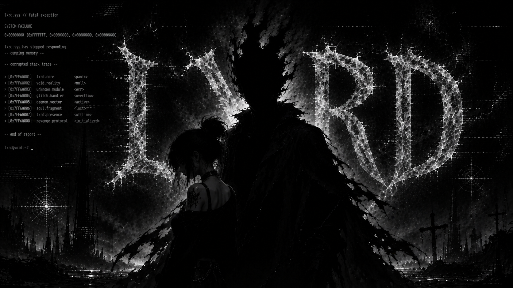

<!-- ══════════════════════════ HERO ══════════════════════════ -->
<div align="center">



<samp>full-stack developer &nbsp;//&nbsp; fivem scripter &nbsp;//&nbsp; producer</samp>

<br/>

<a href="https://github.com/lxrdmami0">
  
</a>

<br/>

<a href="https://discord.gg/lxrd"></a>
<a href="https://instagram.com/lxrdmami"></a>
<a href="https://lxrd.net"></a>

<br/>


<a href="https://github.com/lxrdmami0?tab=followers"></a>
<a href="https://github.com/lxrdmami0?tab=stars"></a>

</div>


<!-- ══════════════════════════ 01 · WHOAMI ══════════════════════════ -->
<div align="center"><h3><samp>[ 01 ] &nbsp; W H O A M I</samp></h3></div>

```console
lxrd@void:~$ cat ./identity.json
```

```jsonc
{
  "alias":     "lxrd / lxrdmami",
  "role":      "Mid-Level Full-Stack Developer",
  "based_in":  "Istanbul, TR",
  "stack":     ["Next.js 15+", "React 19", "TypeScript", "Tailwind"],
  "backend":   ["Node.js", "Express", "PHP", "REST APIs"],
  "data":      ["PostgreSQL", "MySQL", "MongoDB", "Prisma"],
  "sidequest": "FiveM / cfx.re — Lua, JS, NUI, RP infrastructure",
  "offline":   ["music production", "independent distribution"],
  "motto":     "clean code, fast apps, zero noise"
}
```

<table>
<tr>
<td width="50%" valign="top">

**`>` &nbsp;what I do**

Full-stack product work end to end — architecture, data model,
API, interface, deploy. I care about the boring parts: render
cost, query count, bundle size, and code someone else can read
six months later.

</td>
<td width="50%" valign="top">

**`>` &nbsp;where I come from**

Started in game-server scripting and never lost the habit of
reverse-engineering things until they make sense. That's still
how I learn every framework I touch.

</td>
</tr>
</table>


<!-- ══════════════════════════ 02 · STACK ══════════════════════════ -->
<div align="center"><h3><samp>[ 02 ] &nbsp; S T A C K</samp></h3></div>

<div align="center">

<samp>frontend</samp><br/>


<samp>backend &amp; data</samp><br/>


<samp>tooling &amp; infra</samp><br/>


<samp>extra</samp><br/>


</div>

<br/>

| domain | tools | level |
| :--- | :--- | :--- |
| **Frontend** | React, Next.js App Router, TypeScript, Tailwind | `██████████░░` advanced |
| **Backend** | Node.js, Express, REST, Server Actions | `█████████░░░` advanced |
| **Database** | PostgreSQL, MySQL, MongoDB, Prisma | `████████░░░░` proficient |
| **PHP** | vanilla PHP, Laravel basics | `███████░░░░░` proficient |
| **FiveM / cfx.re** | Lua, JS, NUI, ESX / QB frameworks | `██████████░░` advanced |
| **DevOps** | Docker, Nginx, PM2, Cloudflare, VPS deploys | `██████░░░░░░` intermediate |
| **UI / UX** | Figma, responsive systems, a11y basics | `███████░░░░░` proficient |


<!-- ══════════════════════════ 03 · WHAT I BUILD ══════════════════════════ -->
<div align="center"><h3><samp>[ 03 ] &nbsp; W H A T &nbsp; I &nbsp; B U I L D</samp></h3></div>

<table>
<tr>
<td width="33%" align="center" valign="top">

### `web`

**Full-stack apps**

Next.js storefronts, dashboards
and admin panels — auth, payments,
Prisma schemas, server actions,
SEO and Core Web Vitals included.

</td>
<td width="33%" align="center" valign="top">

### `fivem`

**Roleplay infrastructure**

Custom cfx.re resources in Lua +
JS, NUI interfaces that feel like
real apps, ESX / QB integrations
and server-side optimization.

</td>
<td width="33%" align="center" valign="top">

### `sound`

**Independent releases**

Producing, mixing and shipping
tracks on my own — the same
build-ship-iterate loop, just
with a different compiler.

</td>
</tr>
</table>


<!-- ══════════════════════════ 04 · CURRENTLY ══════════════════════════ -->
<div align="center"><h3><samp>[ 04 ] &nbsp; C U R R E N T L Y</samp></h3></div>

```console
lxrd@void:~$ systemctl status lxrd.service
```

```yaml
status:    ● active (running)
building:  full-stack products on the Next.js / React ecosystem
learning:  server components, edge runtimes, performance budgets
exploring: FiveM NUI architecture · type-safe end-to-end APIs
open_to:   freelance work · collaborations · long-night debugging
reach:     discord.gg/lxrd
```


<!-- ══════════════════════════ 05 · TELEMETRY ══════════════════════════ -->
<div align="center"><h3><samp>[ 05 ] &nbsp; T E L E M E T R Y</samp></h3></div>

<div align="center">


<br/><br/>

<samp>contribution matrix</samp>


</div>


<!-- ══════════════════════════ 06 · SNAKE ══════════════════════════ -->
<div align="center"><h3><samp>[ 06 ] &nbsp; S N A K E . E X E</samp></h3></div>

<div align="center">

<picture>
  <source media="(prefers-color-scheme: dark)" srcset="https://raw.githubusercontent.com/lxrdmami0/lxrdmami0/output/github-snake-dark.svg" />
  <source media="(prefers-color-scheme: light)" srcset="https://raw.githubusercontent.com/lxrdmami0/lxrdmami0/output/github-snake.svg" />
  
</picture>

</div>


<!-- ══════════════════════════ 07 · CONNECT ══════════════════════════ -->
<div align="center">

<h3><samp>[ 07 ] &nbsp; C O N N E C T</samp></h3>

<a href="https://discord.gg/lxrd"></a>

<br/>

<table>
<tr>
<td align="center"><a href="https://discord.gg/lxrd"><samp>discord.gg/lxrd</samp></a></td>
<td align="center"><a href="https://instagram.com/lxrdmami"><samp>@lxrdmami</samp></a></td>
<td align="center"><a href="https://lxrd.net"><samp>lxrd.net</samp></a></td>
</tr>
</table>

<br/>

```console
lxrd@void:~$ exit
> connection closed — thanks for stopping by.
```


</div>
